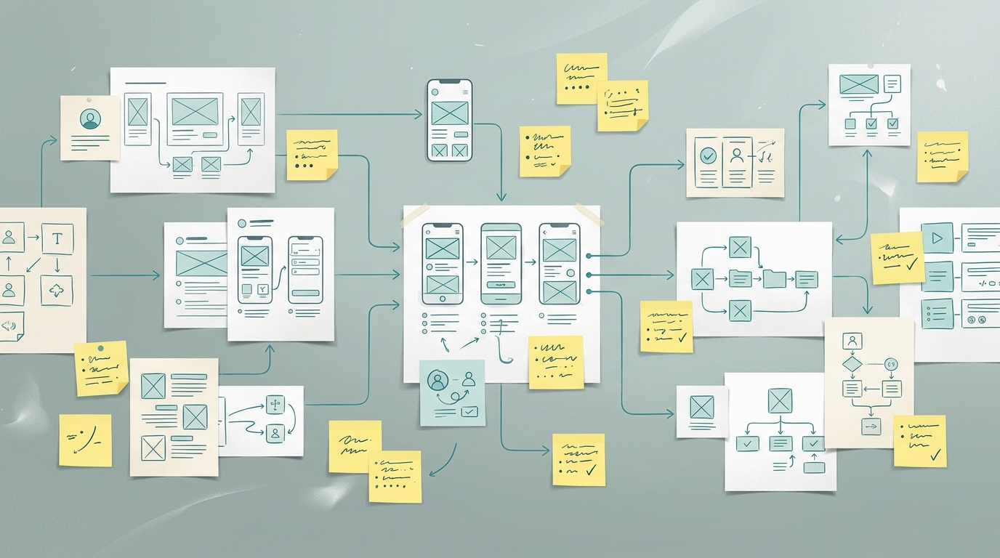
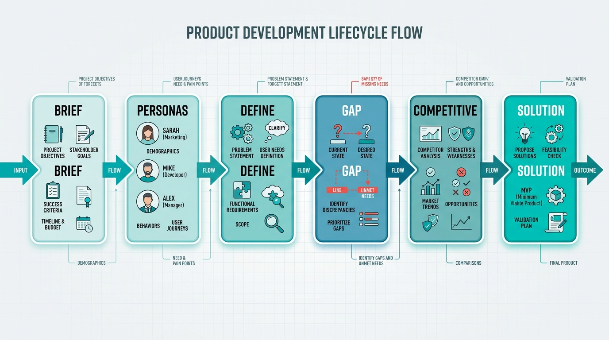
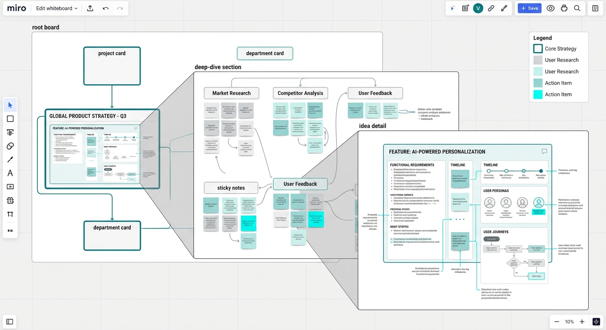

<p align="center">
  
</p>

<h1 align="center">ReasonBoard</h1>

<p align="center">
  <strong>Turn UX reasoning into a freeform whiteboard</strong><br />
  Personas, competitive scans, and solutions you can <em>open</em> — not just slides you flip.
</p>

<p align="center">
  
</p>

<p align="center">
  <a href="#quick-start"></a>
  <a href="LICENSE"></a>
  <a href="docs/method.md"></a>
</p>

---

## Why

Most case decks are linear. ReasonBoard keeps the **path of reasoning** on a pannable board:

- Open a card → deep-dive scene (personas, define, competitors, ideas)
- Freeform tools: stickies, pencil, arrows, undo
- Same typed content drives desktop canvas **and** mobile stack
- Optional AI skills ask questions and write `src/content.ts` for you

Reuse it for product strategy, interview case studies, UX audits, competitive teardown — any domain.

## Method

```
Brief → Personas → Define → Gap → Competitive → Solution → Roadmap
```

<p align="center">
  
</p>

Full write-up: [`docs/method.md`](docs/method.md) · IT: [`docs/method.it.md`](docs/method.it.md)

## Scene stack

Root board → section deep-dive → idea / competitor detail. Esc / Back climbs out.

<p align="center">
  
</p>

## Quick start

```bash
npm install
npm run dev
```

Open http://127.0.0.1:5173/

**Controls (desktop):** Space = pan · pinch / ctrl+scroll = zoom · Open = deep-dive · PageUp/Down = slide · F = fullscreen

## Bring your own case

1. Edit [`src/content.ts`](src/content.ts) — or ask an agent with the ReasonBoard skills
2. Keep types from [`src/contentTypes.ts`](src/contentTypes.ts)
3. Drop images in `public/visuals/`

Schema notes: [`docs/content-schema.md`](docs/content-schema.md)

### AI skills (Cursor / Claude)

| Skill | Does |
|-------|------|
| `reasonboard` | Orchestrates questions → personas → competitive → solution → writes `content.ts` |
| `reasonboard-personas` | Drafts 3 persona cards |
| `reasonboard-competitive` | Drafts competitor notes on a reactive→agentic axis |
| `reasonboard-solution` | Drafts solution muscles + phased roadmap |

Skills live in [`.claude/skills/`](.claude/skills/).

## Demo deck

Ships with a fictional SaaS case — **Northwind Analytics / Northwind Pulse** — so you can click around without any real customer data. Replace it.

## Stack

- React 19 + Vite + TypeScript
- Framer Motion
- Plain CSS with `--rb-*` tokens (teal accent, no purple AI slop)
- Static deploy (Vercel-ready via `vercel.json`)

## Deploy

```bash
npm run build
# preview: npm run preview
# or link the repo to Vercel / any static host serving dist/
```

## Project layout

```
reasonboard/
├── docs/                 # method + schema
├── .claude/skills/       # AI authoring skills
├── public/visuals/       # demo + README art
└── src/
    ├── content.ts        # your deck (swap this)
    ├── contentTypes.ts
    ├── App.tsx
    └── whiteboard/       # freeform engine
```

## License

MIT © Alek
