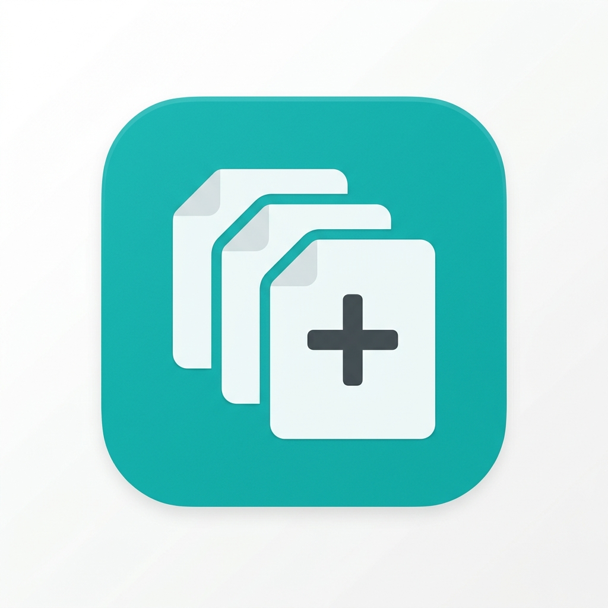
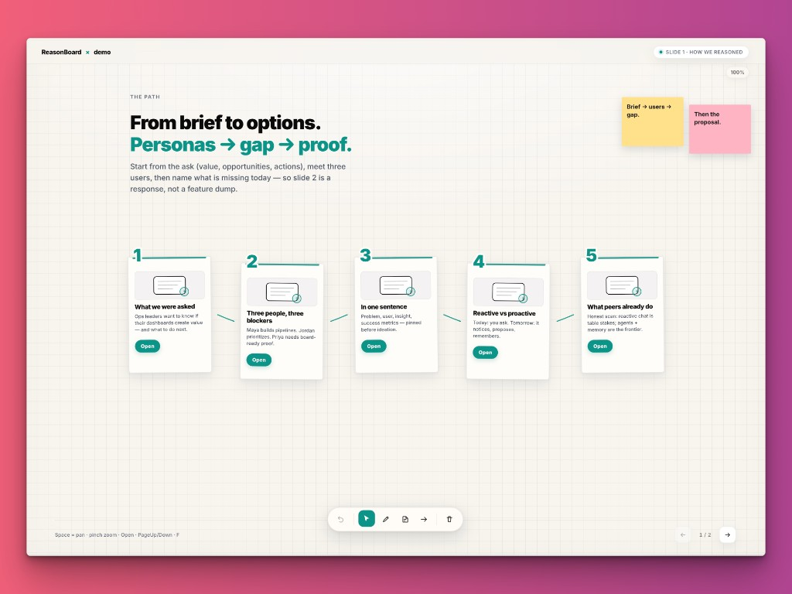
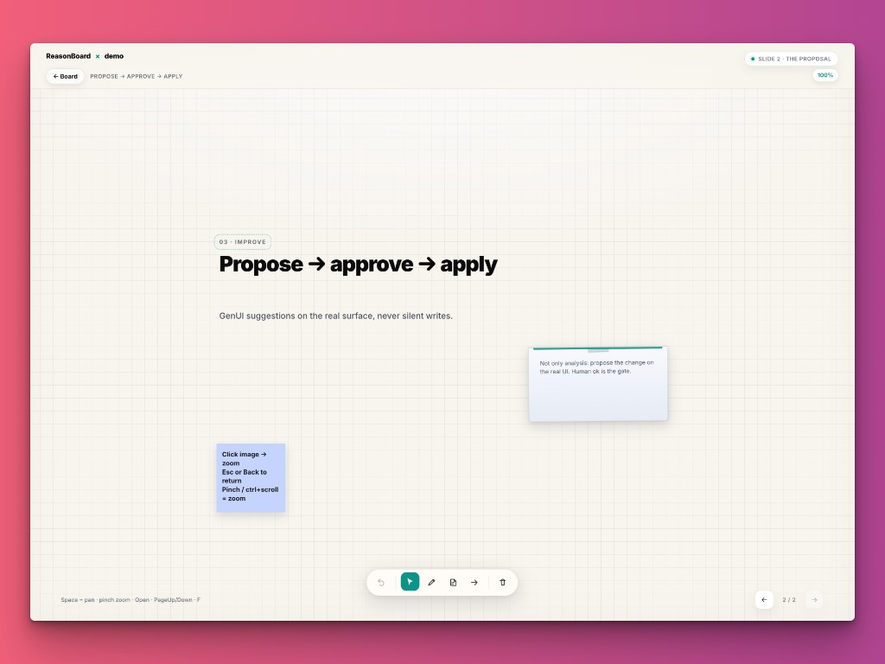

<p align="center">
  
</p>

<h1 align="center">ReasonBoard</h1>

<p align="center">
  <strong>Turn UX reasoning into a freeform whiteboard</strong><br />
  Personas, competitive scans, and solutions you can <em>open</em> — not just slides you flip.
</p>

<p align="center">
  
</p>

<p align="center">
  <a href="#quick-start"></a>
  <a href="LICENSE"></a>
  <a href="docs/method.md"></a>
  <a href="skills/"></a>
</p>

---

## What is this?

**ReasonBoard** is an open-source kit for presenting *how you reasoned* — not a feature dump.

You (or an AI skill) fill a typed deck: brief → personas → define → gap → competitive → solution.  
The app turns that into a **pannable whiteboard**: open a card, dive into post-its and evidence, climb back out. Same content works on desktop canvas and mobile stack.

Use it for product strategy, interview case studies, UX audits, competitive teardowns — any domain.

## Why not just slides?

| Slides | ReasonBoard |
|--------|-------------|
| Linear flip | Freeform path you can rearrange |
| Flat bullets | Deep-dive scenes (personas, competitors, ideas) |
| Copy pasted by hand | Typed `content.ts` + AI skills |
| One layout | Desktop whiteboard + mobile fallback |

## Method

```
Brief → Personas → Define → Gap → Competitive → Solution → Roadmap
```

1. **Brief** — value, opportunities, actions (20 seconds out loud)
2. **Personas** — usually three blockers (build / prioritize / prove)
3. **Define** — problem · user · insight · metrics
4. **Gap** — what’s missing today (often: reactive, generic, non-applied, forgetful)
5. **Competitive** — honest axis; optional live capture via `skills/research` + agent-browser
6. **Solution** — few clear muscles + phased roadmap

Full write-up: [`docs/method.md`](docs/method.md) · IT: [`docs/method.it.md`](docs/method.it.md)

## Scene stack (real product)

Root board → section deep-dive → idea / competitor detail. Esc / Back climbs out.

<p align="center">
  
</p>

<p align="center">
  <em>Root — open a card to dive in</em>
</p>

<p align="center">
  
</p>

<p align="center">
  <em>Deep-dive — titles, stickies, evidence; Back returns to the board</em>
</p>

## Quick start

```bash
git clone https://github.com/AlekDob/reasonboard.git
cd reasonboard
npm install
npm run dev
```

Open http://127.0.0.1:5173/

**Controls (desktop):** Space = pan · pinch / ctrl+scroll = zoom · Open = deep-dive · PageUp/Down = slide · F = fullscreen

## Skills

Canonical skills live in [`skills/`](skills/). This repo also wires them under [`.claude/skills/`](.claude/skills/) (symlinks), so **Cursor / Claude Code pick them up automatically** when the project is open — no install step required for local work.

Index + install notes: [`skills/README.md`](skills/README.md)

### What each skill does

| Skill | Does | Trigger when you say… |
|-------|------|------------------------|
| [`ux`](skills/ux/) | Runs the method: questions → personas → define → gap → competitive → solution outline | “help me reason about this product”, “UX case”, “build the narrative” |
| [`research`](skills/research/) | Live competitor capture with **agent-browser** → screenshots + honest notes | “screenshot Klaviyo / peer X”, “competitive scan with real pages” |
| [`reasonboard`](skills/reasonboard/) | Writes typed [`src/content.ts`](src/content.ts) the whiteboard can open | “turn this into a ReasonBoard deck”, “regenerate content.ts” |
| [`reasonboard-personas`](skills/reasonboard-personas/) | Drafts 3 persona cards | (usually called by `reasonboard` / `ux`) |
| [`reasonboard-competitive`](skills/reasonboard-competitive/) | Fills `competitorNotes` | after `research`, or from known peers |
| [`reasonboard-solution`](skills/reasonboard-solution/) | Solution muscles + phased roadmap | slide 2 of the deck |

### Recommended flow

```text
ux  →  (optional) research  →  reasonboard  →  npm run dev
```

1. **`ux`** — agent interviews you, confirms personas / define / gap / solution outline  
2. **`research`** — optional; only if you want real competitor screenshots (`npm i -g agent-browser`)  
3. **`reasonboard`** — agent writes `src/content.ts` from the outline  
4. Open the app and click through the board  

### Example prompts

```text
Use the ux skill: we're pitching an AI inbox for ops dashboards.
Three personas, honest gap vs chat-only tools, then a short solution outline.

Then use research to capture public pages for Peer A and Peer B into public/visuals/competitive/.

Then use reasonboard to replace src/content.ts with a two-slide deck in English.
```

Or skip research and go straight to the deck:

```text
Use reasonboard: rebuild the demo deck for a B2B scheduling product.
Ask me the brief questions first.
```

### Optional: install skills globally

Only needed if you want the same skills outside this repo:

```bash
cd reasonboard
ln -sf "$(pwd)/skills/ux" ~/.claude/skills/ux
ln -sf "$(pwd)/skills/research" ~/.claude/skills/research
ln -sf "$(pwd)/skills/reasonboard" ~/.claude/skills/reasonboard
ln -sf "$(pwd)/skills/reasonboard-personas" ~/.claude/skills/reasonboard-personas
ln -sf "$(pwd)/skills/reasonboard-competitive" ~/.claude/skills/reasonboard-competitive
ln -sf "$(pwd)/skills/reasonboard-solution" ~/.claude/skills/reasonboard-solution
```

### `research` + agent-browser

`research` does **not** vendor the full browser skill. It expects the [`agent-browser`](https://github.com/vercel-labs/agent-browser) CLI:

```bash
npm i -g agent-browser
which agent-browser   # must be on PATH
```

If the system **agent-browser** skill is also installed on your machine, the agent should follow that for snapshot/ref details; `skills/research` adds ReasonBoard paths (`public/visuals/competitive/`, `competitorNotes` fields).

## Bring your own case

1. Run the skill flow above, **or** edit [`src/content.ts`](src/content.ts) by hand  
2. Keep types from [`src/contentTypes.ts`](src/contentTypes.ts)  
3. Drop images in `public/visuals/`  

Schema: [`docs/content-schema.md`](docs/content-schema.md)

## Demo deck

Ships with a fictional SaaS case — **Northwind Analytics / Northwind Pulse** — so you can click around with zero customer data. Replace it when you’re ready.

## Stack

- React 19 + Vite + TypeScript  
- Framer Motion  
- Plain CSS with `--rb-*` tokens (teal accent — no purple AI slop)  
- Static deploy (Vercel-ready via `vercel.json`)

## Deploy

```bash
npm run build
# npm run preview
# or connect the repo to Vercel / any static host serving dist/
```

## Layout

```
reasonboard/
├── skills/               # ux · research · reasonboard (canonical)
├── .claude/skills/       # symlinks for in-repo agents
├── docs/                 # method + schema
├── public/visuals/       # demo + README screenshots
└── src/
    ├── content.ts        # ← your deck (swap this)
    ├── contentTypes.ts
    ├── App.tsx
    └── whiteboard/       # freeform engine
```

## License

MIT © [Alek](https://github.com/AlekDob)
